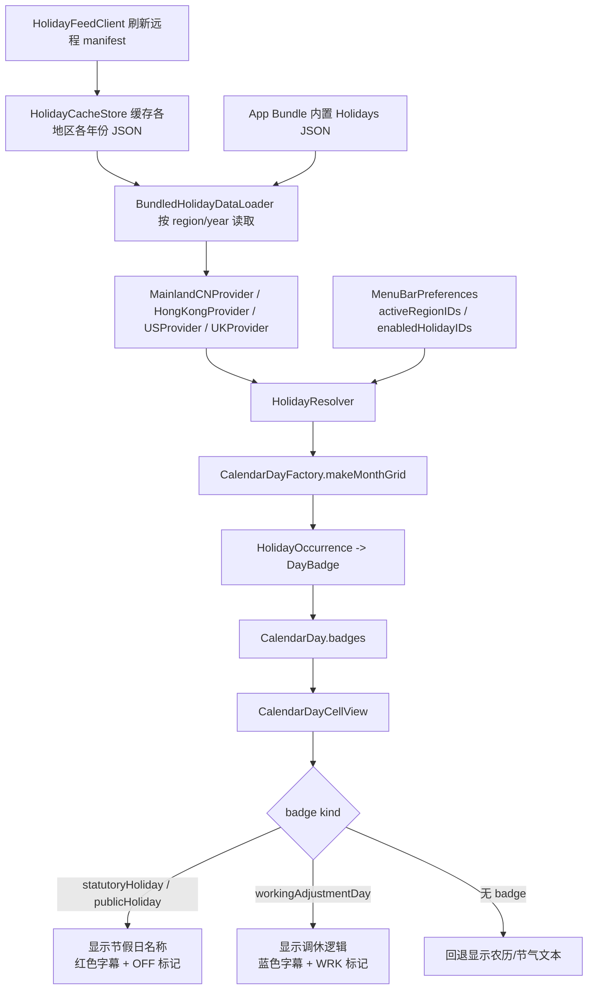

<p align="center">
  
</p>

<h1 align="center">Calendar Pro</h1>

<p align="center">
  原生 macOS 菜单栏日历工具，整合菜单栏时钟、月历、农历、节假日、天气、番茄钟、老黄历、拼假建议、日程与提醒事项。
</p>

<p align="center">
  macOS 14+ · SwiftUI + AppKit · EventKit · Sparkle
</p>

<table>
  <tr>
    <th>亮色主题</th>
    <th>暗色主题</th>
  </tr>
  <tr>
    <td>
      
    </td>
    <td>
      
    </td>
  </tr>
  <tr>
    <th colspan="2">日程详情页</th>
  </tr>
  <tr>
    <td colspan="2">
      
    </td>
  </tr>
</table>

## 概览

Calendar Pro 是一个以菜单栏为核心的 macOS 原生效率工具。它不是完整的日历客户端，而是一个更轻量、更适合高频查看的桌面入口：抬头看菜单栏即可获取时间与日期信息，点击状态栏即可展开月历面板，进一步查看农历、节假日、天气、当天日程和提醒事项。

当前仓库对应的已发布版本为 `0.1.9`，详细变更见 [CHANGELOG.md](./CHANGELOG.md)。

## 核心特性

- **可配置菜单栏显示项**：日期、时间、星期、农历、节假日、番茄钟状态均可独立开关、排序与样式切换。
- **原生月历弹层**：支持月份切换、年份/月选择器、今日高亮、周起始日配置，日历格子上以圆点紧凑标示当天有日程的日期。
- **农历与传统节日**：支持多种农历展示格式，适合中文用户的日常查看习惯。
- **老黄历**：基于农历日柱提供当日宜忌建议。
- **地区化节假日**：内置中国大陆、香港、美国、英国节假日提供方，支持远程节假日清单刷新与缓存回退。
- **公历纪念日**：支持公历节日与纪念日展示。
- **天气**：支持当前天气与逐日天气预报，可按城市搜索，支持 Open-Meteo 与和风天气平台切换，支持日期感知的预报切换，含温度、湿度、风速、空气质量等详细气象指标。
- **番茄钟**：内置番茄工作法计时器，支持阶段结束提醒，菜单栏显示计时状态，含统计面板。
- **拼假建议**：自动识别法定假日与周末组合，给出拼假机会提示。
- **日历与提醒事项集成**：基于 EventKit 读取系统日历和提醒事项，可按日历源/列表精细筛选；支持创建、编辑、删除日程和提醒事项。
- **详情体验完善**：点击日程可打开独立详情窗口，展示参会人、备注、日历颜色和会议链接（支持 Zoom、Google Meet、Microsoft Teams、腾讯会议、飞书、Webex、钉钉等平台识别与一键加入）；提醒事项支持完成状态切换和打开系统提醒事项应用。
- **菜单栏友好**：支持中文日期样式、按分钟或按秒动态刷新、样式变更即时生效、即将开始的事件红点提示。
- **桌面应用能力**：支持开机启动、Sparkle 自动更新（稳定版与预发布版双通道）、签名打包与 DMG 分发。

## 适用场景

- 希望在菜单栏快速查看日期、时间、星期和节假日。
- 需要一个比系统日历更轻、更聚焦"查看与快速操作"的月历工具。
- 希望在中文语境下同时看到农历、老黄历、法定节假日和调休信息。
- 习惯在菜单栏快速浏览当天会议和提醒事项，而不是频繁切换到完整日历应用。
- 需要番茄钟辅助专注工作，并希望计时状态在菜单栏可见。
- 需要快速查看天气，结合日历规划出行。
- 寻找法定假日附近的拼假机会，提前规划长假。

## 功能边界

- 这是一个菜单栏日历与信息查看工具，以"查看、跳转、快速处理"为核心。
- 支持基本的日程与提醒事项创建、编辑、删除，但不以替代完整日历应用为目标。
- 节假日数据目前聚焦中国大陆、香港、美国、英国，尚未内置全球规则引擎。
- 天气数据依赖远程 API，首次使用可授予位置权限或手动搜索城市；和风天气需要在设置中填写自己的 API Host 与 API Key。

## 技术架构

- `AppKit` 负责菜单栏状态项、弹层生命周期和独立详情窗口等桌面交互外壳。
- `SwiftUI` 负责弹层、设置页和详情界面，保持界面实现现代化且易维护。
- `EventKit` 提供系统日历与提醒事项读写能力。
- `Sparkle` 提供稳定版与预发布版自动更新能力。
- 节假日数据采用"内置 JSON + 远程 Manifest + 本地缓存"策略，在离线场景下依然可用。
- 天气数据通过远程 API 获取，默认使用 Open-Meteo；也可在设置中切换到和风天气，适合中国大陆网络与本地 AQI 口径。自动位置优先使用系统定位，失败时回落到 IP 定位。

## 节假日显示流程



## 快速开始

### 环境要求

- macOS `14.0+`
- Xcode `16+`
- 首次运行时，如需查看日程或提醒事项，需要授予对应系统权限

### 本地开发

```bash
open CalendarPro.xcodeproj
```

或直接使用命令行：

```bash
xcodebuild build \
  -project CalendarPro.xcodeproj \
  -scheme CalendarPro \
  -destination 'platform=macOS'
```

### 运行测试

```bash
xcodebuild test \
  -project CalendarPro.xcodeproj \
  -scheme CalendarPro \
  -destination 'platform=macOS'
```

当前仓库包含较完整的单元测试与 UI 测试。

## 打包与分发

项目已内置打包脚本，可直接生成通用二进制 DMG：

```bash
bash scripts/build/package-app.sh
```

脚本会完成以下工作：

- 解析 Swift Package 依赖
- 归档通用二进制应用
- 注入 Sparkle 公钥
- 进行本地 ad-hoc 签名
- 产出 `dist/CalendarPro-<version>-universal.dmg`

如需正式签名与公证，可结合以下环境变量启用：

- `CODESIGN_ENABLED=1`
- `APPLE_TEAM_ID`
- `APPLE_ID`
- `APPLE_APP_PASSWORD`

仓库还包含 GitHub Actions 发布流程，在推送 `v*` 标签后会自动构建、签名、更新 appcast 并发布。
Sparkle appcast 默认通过 `raw.githubusercontent.com` 读取 [docs/appcast.xml](./docs/appcast.xml) 与 [docs/appcast-beta.xml](./docs/appcast-beta.xml)，避免 GitHub Pages 或自定义域名重定向导致更新检查失败。

## 权限与运行时行为

- 日历权限：用于读取和编辑系统日历中的日程。
- 提醒事项权限：用于读取提醒事项，并支持创建、编辑和切换完成状态。
- 登录项权限：开启开机启动时，系统可能要求用户在"系统设置 > 通用 > 登录项"中批准。
- 位置权限：天气功能可按城市搜索，也可使用当前位置获取天气数据；自动模式优先使用系统定位，拒绝或失败时回落到 IP 定位。
- 网络访问：用于天气数据获取、节假日远程清单刷新与 Sparkle 更新检查；即使离线，内置和缓存数据仍可继续工作。

## 项目结构

```text
CalendarPro/
├── App/                       # 菜单栏控制、弹层控制、详情窗口、更新与开机启动
├── Features/
│   ├── Almanac/               # 老黄历宜忌建议
│   ├── Calendar/              # 月历网格与日期模型
│   ├── Events/                # 日程/提醒事项访问、会议链接识别与加入
│   ├── Holidays/              # 节假日提供方、解析与注册表
│   ├── Lunar/                 # 农历、节气与传统节日
│   ├── MenuBar/               # 菜单栏文本渲染、刷新调度与即将开始事件监控
│   ├── Pomodoro/              # 番茄钟计时、提醒与统计
│   ├── VacationPlanning/      # 拼假机会分析
│   └── Weather/               # 天气获取、城市搜索与日期感知预报
├── Infrastructure/
│   ├── Data/                  # 节假日 Manifest、缓存与远程拉取
│   ├── AppLanguage.swift      # 语言切换
│   ├── AppLocalization.swift  # 本地化字符串
│   ├── LocaleFeatureAvailability.swift
│   └── TimeRefreshCoordinator.swift
├── Resources/
│   ├── Assets.xcassets/       # 应用图标与资源
│   └── Holidays/              # 内置节假日 JSON（mainland-cn / hong-kong / uk / us）
├── Settings/                  # 偏好设置与持久化
└── Views/
    ├── Popover/               # 弹层视图（月历、日程卡片、天气条、老黄历条、番茄钟条等）
    └── Settings/              # 设置页视图（通用、菜单栏、日程、地区、番茄钟、关于）

CalendarProTests/              # 单元测试
CalendarProUITests/            # UI 测试
feed/holidays/                 # 远程节假日数据源
scripts/build/                 # 打包、签名、公证脚本
docs/                          # appcast 与发布清单
```

## 当前已支持内容

- 菜单栏时间/日期/星期/农历/节假日组合展示
- 即将开始事件红点提示
- 中国大陆法定节假日与调休信息
- 香港公众假期数据
- 美国公众假期数据
- 英国公众假期数据
- 公历纪念日与节日
- 老黄历宜忌建议
- 月历格子紧凑事件圆点标示
- 当前天气与逐日天气预报（含详细气象指标与城市搜索）
- 番茄工作法计时器（含阶段结束提醒与统计）
- 拼假机会分析
- 月历面板中的当天日程与提醒事项列表
- 日程与提醒事项的创建、编辑、删除
- 会议链接识别（Zoom、Google Meet、Microsoft Teams、腾讯会议、飞书、Webex、VooV Meeting、Whereby、GoTo Meeting、钉钉）
- 日历颜色在日程卡片中展示
- Sparkle 自动更新与稳定/预发布双通道

## 许可证

本项目基于 [MIT License](./LICENSE) 开源。

## 维护说明

- 如果你修改了节假日数据结构，请同时检查 [feed/holidays](./feed/holidays) 与 [docs/appcast.xml](./docs/appcast.xml) 相关流程。
- 如果你调整了发布逻辑，请同步更新 [scripts/build/package-app.sh](./scripts/build/package-app.sh) 和 [scripts/build/codesign-and-notarize.sh](./scripts/build/codesign-and-notarize.sh)。
