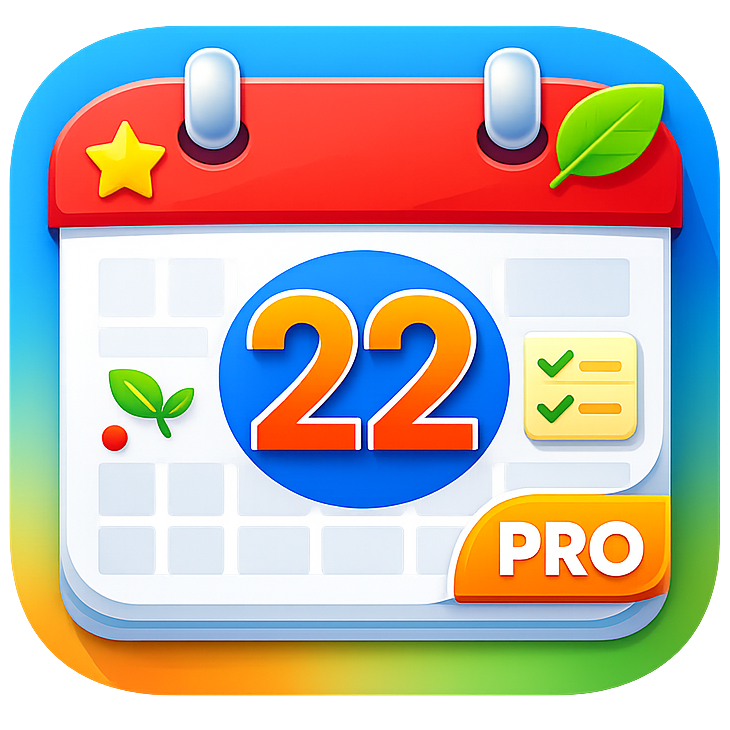

<p align="center">
  
</p>

<h1 align="center">Calendar Pro</h1>

<p align="center">
  原生 macOS 菜单栏日历工具，整合菜单栏时钟、月历、农历、地区化节假日、日程与提醒事项。
</p>

<p align="center">
  macOS 14+ · SwiftUI + AppKit · EventKit · Sparkle
</p>

## 概览

Calendar Pro 是一个以菜单栏为核心的 macOS 原生效率工具。它不是完整的日历客户端，而是一个更轻量、更适合高频查看的桌面入口：抬头看菜单栏即可获取时间与日期信息，点击状态栏即可展开月历面板，进一步查看农历、节假日、当天日程和提醒事项。

当前仓库对应的已发布版本为 `0.1.0`，详细变更见 [CHANGELOG.md](./CHANGELOG.md)。

## 核心特性

- 可配置菜单栏显示项：日期、时间、星期、农历、节假日均可独立开关、排序与样式切换。
- 原生月历弹层：支持月份切换、年份/月选择器、今日高亮、周起始日配置。
- 农历与传统节日：支持多种农历展示格式，适合中文用户的日常查看习惯。
- 地区化节假日：内置中国大陆与香港节假日提供方，支持远程节假日清单刷新与缓存回退。
- 日历与提醒事项集成：基于 EventKit 读取系统日历和提醒事项，可按日历源/列表精细筛选。
- 详情体验完善：点击日程可打开独立详情窗口，展示参会人、备注和会议链接；提醒事项支持完成状态切换和打开系统提醒事项应用。
- 菜单栏友好：支持中文日期样式、按分钟或按秒动态刷新、样式变更即时生效。
- 桌面应用能力：支持开机启动、Sparkle 自动更新、签名打包与 DMG 分发。

## 适用场景

- 希望在菜单栏快速查看日期、时间、星期和节假日。
- 需要一个比系统日历更轻、更聚焦“查看”的月历工具。
- 希望在中文语境下同时看到农历、法定节假日和调休信息。
- 习惯在菜单栏快速浏览当天会议和提醒事项，而不是频繁切换到完整日历应用。

## 功能边界

- 这是一个菜单栏日历与信息查看工具，不是完整的日历编辑器。
- 当前重点是“查看、跳转、快速处理”，而不是创建或编辑 EventKit 中的日程内容。
- 节假日数据目前聚焦中国大陆与香港，尚未内置全球规则引擎。

## 技术架构

- `AppKit` 负责菜单栏状态项、弹层生命周期和独立详情窗口等桌面交互外壳。
- `SwiftUI` 负责弹层、设置页和详情界面，保持界面实现现代化且易维护。
- `EventKit` 提供系统日历与提醒事项读写能力。
- `Sparkle` 提供稳定版与预发布版自动更新能力。
- 节假日数据采用“内置 JSON + 远程 Manifest + 本地缓存”策略，在离线场景下依然可用。

## 快速开始

### 环境要求

- macOS `14.0+`
- Xcode `16+`
- 首次运行时，如需查看日程或提醒事项，需要授予对应系统权限

### 本地开发

```bash
open CalendarPro.xcodeproj
```

或直接使用命令行：

```bash
xcodebuild build \
  -project CalendarPro.xcodeproj \
  -scheme CalendarPro \
  -destination 'platform=macOS'
```

### 运行测试

```bash
xcodebuild test \
  -project CalendarPro.xcodeproj \
  -scheme CalendarPro \
  -destination 'platform=macOS'
```

当前仓库包含较完整的单元测试与 UI 测试；我在本地生成 README 时执行了上述命令，结果为 `100 tests, 0 failures`。

## 打包与分发

项目已内置打包脚本，可直接生成通用二进制 DMG：

```bash
bash scripts/build/package-app.sh
```

脚本会完成以下工作：

- 解析 Swift Package 依赖
- 归档通用二进制应用
- 注入 Sparkle 公钥
- 进行本地 ad-hoc 签名
- 产出 `dist/CalendarPro-<version>-universal.dmg`

如需正式签名与公证，可结合以下环境变量启用：

- `CODESIGN_ENABLED=1`
- `APPLE_TEAM_ID`
- `APPLE_ID`
- `APPLE_APP_PASSWORD`

仓库还包含 GitHub Actions 发布流程，在推送 `v*` 标签后会自动构建、签名、更新 appcast 并发布。

## 权限与运行时行为

- 日历权限：用于读取系统日历中的当天日程。
- 提醒事项权限：用于读取提醒事项，并支持切换完成状态。
- 登录项权限：开启开机启动时，系统可能要求用户在“系统设置 > 通用 > 登录项”中批准。
- 网络访问：用于节假日远程清单刷新与 Sparkle 更新检查；即使离线，内置和缓存数据仍可继续工作。

## 项目结构

```text
CalendarPro/
├── App/                  # 菜单栏控制、弹层控制、设置窗口、更新与开机启动
├── Features/
│   ├── Calendar/         # 月历网格与日期模型
│   ├── Events/           # 日程/提醒事项访问与会议链接识别
│   ├── Holidays/         # 节假日提供方、解析与注册表
│   ├── Lunar/            # 农历与传统节日
│   └── MenuBar/          # 菜单栏文本渲染与刷新调度
├── Infrastructure/Data/  # 节假日 Manifest、缓存与远程拉取
├── Settings/             # 偏好设置与持久化
└── Views/                # 弹层与设置页 SwiftUI 视图

CalendarProTests/         # 单元测试
CalendarProUITests/       # UI 测试
feed/holidays/            # 远程节假日数据源
scripts/build/            # 打包、签名、公证脚本
docs/                     # 设计文档、发布清单与 appcast
```

## 当前已支持内容

- 菜单栏时间/日期/星期/农历/节假日组合展示
- 中国大陆法定节假日与调休信息
- 香港公众假期数据
- 月历面板中的当天日程与提醒事项列表
- 会议链接识别（如 Zoom、Google Meet、Teams、腾讯会议、飞书、钉钉等）
- Sparkle 自动更新与稳定/预发布通道

## 维护说明

- 如果你修改了节假日数据结构，请同时检查 [feed/holidays](./feed/holidays) 与 [docs/appcast.xml](./docs/appcast.xml) 相关流程。
- 如果你调整了发布逻辑，请同步更新 [scripts/build/package-app.sh](./scripts/build/package-app.sh) 和 [scripts/build/codesign-and-notarize.sh](./scripts/build/codesign-and-notarize.sh)。
- 项目当前未附带 `LICENSE` 文件；如果计划公开长期维护，建议尽快补充许可证声明。
